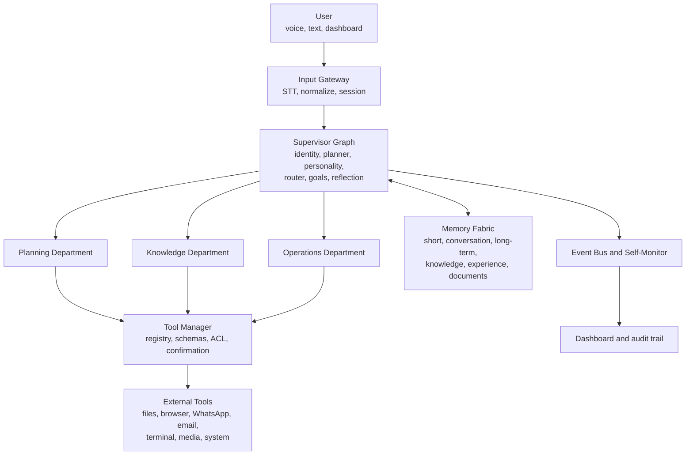
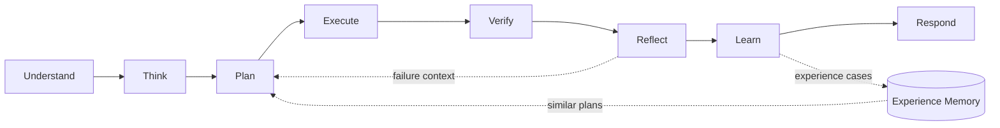

# LOSA

## Lisa Operating System Architecture


<p align="center"><strong>A local-first companion operating system for one person.</strong><br>
Memory, planning, tools, voice, personality, security, and learning in one evolving system.</p>

<p align="center">
  
  
  
  
</p>

> Lisa is not a chatbot with a personality prompt. She is an operating system
> for a long-term relationship between a person and an intelligent, inspectable
> software companion.

This README is the project guide. It describes both what is implemented and
what is deliberately designed for later phases. **`[Implemented]`** means the
repository has a usable path today. **`[Planned]`** means the architecture and
contracts are defined, but the feature is not yet complete.

## At A Glance

| | |
| --- | --- |
| **Owner** | Manish |
| **Runtime** | Python, LangGraph, SQLite, ChromaDB |
| **Interfaces** | Text, voice, web dashboard |
| **Primary target** | Windows 11, RTX 3050, local-first execution |
| **Current entry point** | `python main_v3.py` |
| **Current position** | Phase 1 supervisor skeleton; legacy v1 remains available |

## What Lisa Is

Lisa combines two products in one system:

- **A work system:** files, documents, browser research, WhatsApp, email,
  terminal, media, reminders, scheduling, and project preparation.
- **A companion:** long-term memory, goals, habits, relationship context,
  emotional reasoning, initiative, disagreement, and negotiated autonomy.

The central behavior is not “prompt in, answer out.” It is:

```text
Understand -> Think -> Plan -> Execute -> Verify -> Reflect -> Learn -> Respond
```

The LLM provides reasoning where useful. Memory, permissions, tool execution,
verification, personality, and learning are explicit software systems around it.

## Project Status

### Current position: Phase 1

The current repository has a working v1 implementation and a real LangGraph
supervisor path. The intended command for the new path is:

```powershell
python main_v3.py
```

The existing `main.py`, `voice_main.py`, and `web_server.py` remain available
while the migration proceeds. Long-term memory work is being organized around
`data/memory_fabric/longterm.sqlite`; existing vector data remains under
`data/memory/vectordb/`.

### Delivered

- **[Implemented]** Multi-provider LLM client, provider rotation, and token logging.
- **[Implemented]** Local embeddings and ChromaDB knowledge/RAG pipeline.
- **[Implemented]** Text, voice, web, document, file, WhatsApp, and system paths.
- **[Implemented]** LangGraph state, schemas, checkpointing, and supervisor wiring.
- **[Implemented]** Phase 1 node contracts: understand, plan, personality,
  execute, verify, reflect, learn, and respond.

### Being built

- **[Planned]** Six-store memory fabric and bounded `MemoryPacket` retrieval.
- **[Planned]** Experience memory, confidence decay, and bug-fix retrieval.
- **[Planned]** Tool Manager, ACL, confirmation interrupts, and MCP exposure.
- **[Planned]** Planning, Knowledge, and Operations department subgraphs.
- **[Planned]** Relationship, personality, initiative, and autonomy engines.
- **[Planned]** Event bus, audit trail, confidential-document enforcement, and
  Dashboard 2.0.

The detailed phase acceptance criteria are in
[`docs/architecture_blueprint/08_ROADMAP.md`](docs/architecture_blueprint/08_ROADMAP.md).

### Current checkpoint

The next implementation checkpoint is the Phase 1 supervisor path:

1. Run `python main_v3.py` and keep the legacy path available for comparison.
2. Complete the graph-backed identity and legacy response wrapper.
3. Move confirmation behavior into graph interrupts.
4. Start Phase 2 by wiring the six memory stores, beginning with long-term
  SQLite storage and the bounded `MemoryPacket`.

This is the maintained version of the project handoff in
[`where_we_left.md`](where_we_left.md).

## Running Lisa

### Prerequisites

- Windows 11 is the primary target.
- Python 3.11 or newer is recommended.
- The reference development machine is an RTX 3050 with 4 GB VRAM and 16 GB
  RAM. Local models should be chosen to fit available memory.
- Create and activate a virtual environment before installing dependencies.
- Put provider credentials in environment configuration. Never commit keys or
  passwords in source files, comments, or documentation.
- Ollama is optional for the current prototype but is required by the planned
  local model routing paths.

### Install

```powershell
python -m venv .venv
.\.venv\Scripts\Activate.ps1
python -m pip install --upgrade pip
pip install -r requirements.txt
```

Some Windows OCR, CUDA, and audio dependencies may need platform-specific
installation. See the comments in `requirements.txt` and the setup notes under
`docs/phase_setup/`.

### Start the Phase 1 text pipeline

```powershell
python main_v3.py
```

The older prototype remains available through `main.py`; it is intentionally
kept during migration so behavior can be compared while the new graph is
implemented.

### Other entry points

- `python main.py`: legacy text prototype.
- `python voice_main.py`: legacy voice path.
- `python web_server.py`: web/API path, subject to its configured environment.

### Data locations

- Graph checkpoints: `data/lisa_checkpoints.sqlite`.
- ChromaDB data: `data/memory/vectordb/`.
- Token usage: `data/token_usage.json`.
- Planned audit trail: `data/audit_log.jsonl`.
- Long-term memory in the current `lisa_os` migration path is intended for
  `data/memory_fabric/longterm.sqlite`; verify the active store configuration
  before moving or deleting existing data.

## Target architecture

Lisa is a supervisor-orchestrated, department-based system:



The supervisor owns orchestration. Departments return results and do not call
one another directly. The Tool Manager is the permission boundary between Lisa
and the operating system.

### Core systems

1. **Identity Layer:** stable name, creator, values, goals, access scope, and
   hard rules. It is human-editable but changes require administrative control.
2. **Planner:** decomposes a request into validated, dependency-aware steps.
3. **Executive:** runs plan steps through departments and the Tool Manager.
4. **Tool Manager:** the only layer that decides whether and how a tool runs.
5. **Memory System:** six stores with separate schemas and retrieval policies.
6. **Reflection Engine:** evaluates plan quality and failures after execution.
7. **World Model:** expands implicit requirements such as travel, time, and
   dependencies.
8. **Goal Manager:** tracks placement, FYP, internship, health, and other goals.
9. **Self-Monitor:** records latency, tokens, costs, errors, retries, and health.
10. **Learning Engine:** stores inspectable experience cases for future planning.

### Relationship systems

- **Personality Engine:** behavior, tone, refusal, care, humor, and negotiation.
- **Relationship Model:** different behavior for the owner, friends, professors,
  parents, and unknown users.
- **Initiative Engine:** meaningful reminders and proactive actions.
- **Autonomy Engine:** permission-scoped escalation from reminder to emergency
  system action.

## Turn pipeline

Every task follows this contract:



| Step | Owner | Responsibility |
| --- | --- | --- |
| Understand | emotional reasoning and intent | Detect mood, intent, relationship, urgency, and mode. |
| Think | planner | Expand goals, context, world-model dependencies, and past cases. |
| Plan | planner and personality | Produce a schema-validated task graph; personality may modify or veto. |
| Execute | departments and Tool Manager | Run dependency-ordered steps under ACL. |
| Verify | verifier | Check evidence such as file existence, delivery, or process state. |
| Reflect | reflection engine | Record whether the plan worked and why it failed. |
| Learn | learning engine | Embed and store the experience case. |
| Respond | personality and responder | Compose the final response and optional audio. |

The current graph is in [`lisa_os/graph.py`](lisa_os/graph.py). It implements
the routing shape for `chat`, `task`, `hybrid`, and `refuse`; some nodes still
use Phase 1 placeholders until later phases provide their stores and tools.

## Departments and tools

Departments are capability domains, not independent employees. They never call
one another directly. The supervisor sends a `PlanStep`; a department returns a
`TaskResult`.

### Planning Department

Browser research, coding, calendar, vision, security checks, and task planning.
It reuses `actions/web_actions.py`, `actions/system_actions.py`, and
`actions/desktop_manager.py` during migration.

### Knowledge Department

Memory CRUD, RAG, documents, notes, files, and database work. It reuses
`memory/`, `training/`, `actions/pdf_processor.py`,
`actions/learn_document.py`, and `tools/file_indexer.py`.

### Operations Department

WhatsApp, email, YouTube/Spotify, terminal, automation, notifications, and
system actions. It reuses `actions/whatsapp_actions.py`,
`actions/wa_send_action.py`, and `actions/system_actions.py`.

### Tool Manager contract

Every registered tool will have:

```text
name, department, risk_level, required_permission, input_schema, handler
```

Risk levels are `read`, `write`, `send`, and `system`:

- `read`: normally allowed.
- `write`: allowed with logging.
- `send`: requires confirmation, such as WhatsApp or email delivery.
- `system`: requires an explicit autonomy grant.

The future MCP server will expose this registry without bypassing the same
permission checks.

## Memory fabric

Lisa does not treat all memory as one RAG collection.

| Store | Contents | Planned backend or lifetime |
| --- | --- | --- |
| Short | Current-turn working context | `LisaState`, one turn |
| Conversation | Recent turns and rolling summary | SQLite, session/days |
| Long-term | Facts, preferences, goals, relationships | SQLite/JSON, persistent |
| Knowledge | Skills and world facts | ChromaDB, persistent |
| Experience | Plans, outcomes, failures, fixes, confidence | ChromaDB, confidence-decayed |
| Document | PDFs, research, company and semester documents | ChromaDB plus classified storage |

The key distinction is:

- Conversation memory answers: “What did we discuss?”
- Knowledge memory answers: “What does Manish know?”
- Experience memory answers: “What worked or failed last time?”

### Retrieval policy

The planned `MemoryPacket` includes recent conversation, relevant long-term
facts, knowledge chunks, similar experience cases, and document chunks only when
the intent and ACL allow them. The total budget is at most 600 tokens, with
priority: relationship facts, current task experience, conversation summary,
then RAG chunks.

### Confidential documents

Documents are classified as `public`, `private`, or `confidential`.
Confidential documents must use a local model only; their raw chunks must never
be included in cloud prompts. This is a code-enforced Model Router rule in the
target design, not a convention.

## Communication and events

Synchronous coordination happens in the supervisor graph. Asynchronous work
uses an in-process event bus first, with Redis as a future replacement.

Every message envelope contains:

```json
{
  "msg_id": "uuid",
  "trace_id": "turn-uuid",
  "from": "knowledge.memory_agent",
  "to": "supervisor",
  "type": "result",
  "payload": {},
  "risk": "read",
  "requires_confirmation": false,
  "timestamp": "2026-08-06T14:22:10Z"
}
```

Planned topics include `os.activity`, `time.tick`, `email.new`,
`whatsapp.unread`, `task.completed`, `health.metrics`, and `goal.deadline`.

The WhatsApp flow remains draft -> confirmation -> send. In the target graph,
the confirmation is a LangGraph interrupt at the `send`-risk step rather than
an isolated regex path.

## Security and autonomy

### Security levels

- **Level 0, God Mode:** full access with administrator authentication.
- **Level 1, Family Mode:** restricted folders and actions are blocked.
- **Level 2, Lockdown:** chat only; tools are disabled.

The old single hardcoded password must not be used. Credentials belong in
environment configuration, should be hashed and rotatable, and must never be
committed.

### Autonomy levels

| Level | Capability |
| --- | --- |
| L1 | Reminder or suggestion |
| L2 | Persistent or strong reminder |
| L3 | Refuse a task that violates an active rule |
| L4 | Emergency system action, such as hibernation |

L4 is possible only with an explicit, rule-scoped grant. Grants include the
condition, action, owner, expiry or reconfirmation period, escalation path, and
cooldown. No grant means no system action. L1 through L4 escalation cannot be
skipped.

Every `send` and `system` action is intended to produce an audit record in
`data/audit_log.jsonl` containing the actor, action, hashed parameters, grant,
and outcome.

## Learning

Lisa learns decisions and workflows, not model weights:

```text
Task -> Execute -> Verify -> Reflect -> Store -> Retrieve next time
```

1. The executor captures results and evidence without extra model cost.
2. A small local model reflects on plan quality, failure cause, and improvement.
3. The case is embedded into the `lisa_experience` collection.
4. The planner retrieves the top similar cases before creating a new plan.
5. Successful reuse reinforces confidence; repeated failure decays it. Cases
   below the confidence threshold are archived.

The same mechanism supports a bug lane containing an error signature, root
cause, failed attempts, successful fix, and confidence. A weekly local job is
also planned for habit and behavioral patterns such as sleep, deep work, and
mood trends.

The existing `training/` pipeline remains the style-memory path: cleaned chat
documents are embedded locally and can later be retrieved by the responder for
tone matching.

## Model routing and cost

The Model Router classifies the need rather than sending every operation to one
provider:

| Need | Intended route |
| --- | --- |
| Simple extraction, formatting, reflection | Local Ollama, zero API cost |
| High-volume strict intent JSON | Gemini Flash-Lite or Groq |
| Personal companion response | Gemini Flash or equivalent |
| Coding | Local Qwen Coder or a stronger provider when needed |
| Vision and deep reasoning | A capable multimodal/reasoning provider, sparingly |

Suggested local models for the reference hardware include `qwen2.5:3b`,
`gemma3:4b`, `llama3.2:3b`, and a quantized coding model. Local MiniLM
embeddings are preferred because they are free and handle Hinglish well.

The intended operating budget is:

- Text-first daily use: approximately `Rs 0` with free tiers and local models.
- Emotional Hinglish voice: approximately `Rs 300-500/month` with Sarvam and
  local fallbacks.
- Optional premium voice: additional provider cost.

The router should degrade cloud calls to local models at a configurable budget
threshold. Usage is tracked in `data/token_usage.json`.

## Repository layout

```text
actions/                 Existing automation handlers
config/                  Settings and prompts
core/                    Legacy agent, LLM client, security, tracing, watcher
data/                    Local databases, vectors, profiles, usage data
docs/                    Architecture, setup, and phase documentation
memory/                  Existing long-term and RAG memory implementation
lisa_os/                 Target supervisor architecture
  graph.py               LangGraph supervisor wiring
  state.py               LisaState flowing through nodes
  schemas.py             Shared node and tool contracts
  nodes/                 Understand, plan, personality, execute, verify,
                         reflect, learn, and respond
  departments/           Planning, Knowledge, and Operations subgraphs
  memory_fabric/         Six-store target memory layout
  model_router/          Local/cloud routing and cost policy
  tool_manager/          Registry, ACL, and future MCP server
  event_bus/             In-process event communication
  autonomy/              Levels, grants, rules, and negotiation
  self_monitor/          Health and execution metrics
  interfaces/            Thin CLI, voice, and web adapters
training/                Chat cleaning and local embedding pipeline
voice/                   STT, TTS, and wake-word prototype
web/                     Web assets and dashboard prototype
main_v3.py               Phase 1 LangGraph text entry point
main.py                  Legacy text entry point
voice_main.py            Legacy voice entry point
web_server.py            Web/API entry point
requirements.txt         Python dependencies
```

## Migration plan

The migration is deliberately incremental so the working v1 system remains
available:

| Phase | Focus | Acceptance direction |
| --- | --- | --- |
| 0 | Freeze, clean, rotate secrets | v1 runs without repository secrets |
| 1 | Supervisor skeleton and identity | Text and voice still work through the graph |
| 2 | Six memory stores | Cases and confidentiality rules are testable |
| 3 | Departments and Tool Manager | Multi-intent tasks and confirmations work |
| 4 | Personality, relationship, emotional reasoning | Behavior is consistent with context |
| 5 | Initiative, event bus, autonomy | Proactive behavior is permission-scoped and audited |
| 6 | Reflection and experience learning | Repeated tasks measurably improve |
| 7 | Voice and emotion upgrade | Hinglish voice has natural emotional behavior |
| 8 | Dashboard 2.0 | Costs, grants, blocked actions, and audit history are visible |
| 9+ | MCP, digital twin, vision, Android companion | Future expansion after the core is stable |

### Refactor rules

- Wrap `core/agent.py` first; do not break the legacy path while extracting
  nodes.
- Move confirmation behavior into graph interrupts.
- Keep regex routing as a low-confidence fallback until planner routing is
  reliable, then retire it.
- Departments may import shared schemas, memory, and Tool Manager interfaces,
  but must not import one another.
- Keep fragile Selenium and desktop automation behind Tool Manager boundaries.
- Test confidential-document routing early because it is a trust requirement.

<br>

<p align="center">
  <strong>LOSA</strong><br>
  Lisa Operating System Architecture<br><br>
  Personal project by <strong>Manish</strong><br>
  <a href="docs/architecture_blueprint/README.md">Architecture Blueprint</a>
  &nbsp;·&nbsp;
  <a href="docs/architecture_blueprint/08_ROADMAP.md">Roadmap</a>
</p>

<p align="center"><sub>Built locally. Designed deliberately. Evolving one phase at a time.</sub></p>


